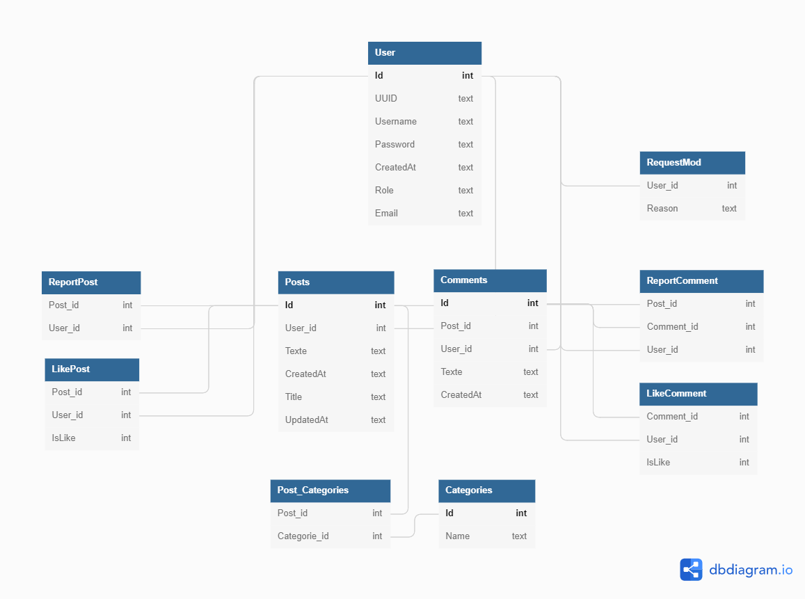

## Présentation du projet

Forum est comme son nom l'indique un forum où des utilisateurs pourront discuter entre eux de leurs sujets préferés sous forme de threads.
Chaque thread peut posséder des catégories que les utilisateurs pourront sélectionner.

## Installation et utilisation

L'installation est simple, il suffit de cloner le répertoire git en faisant la commande :

```bash
git clone https://github.com/Archilive/Forum.git
```

Et d'ensuite aller dans le fichier `FORUM` et faire :

```bash
go run serveur/serveur.go
```

Une fois ces commandes faites, vous pourrez immédiatement ouvrir votre navigateur et accéder au site en tapant [`http://localhost:8080`](http://localhost:8080). Vous allez arriver sur la page d'accueil ou vous trouverez tous les threads récents ainsi que des boutons pour créer un compte ou se connecter si vous possédez déjà un compte.

## Fonctionnalités

- Pouvoir créer un compte et se connecter.
- Pouvoir modifier les informations de l'utilisateur ainsi que l'image de profil.
- Pouvoir créer un thread avec aucune/une/plusieurs catégories.
- Pouvoir commenter et alimenter des threads pour intéragir avec les autres utilisateurs.
- Pouvoir mettre un like/dislike sur un thread ou commentaire pour partager son opinion ou une image.
- Pouvoir trier les threads dans un ordre précis que l'on définit par likes/dislikes, nombre de commentaires ou date d'update.
- Pouvoir promouvoir un administrateur via la commande ci-dessous mais impossible d'y accéder sur le site afin de garantir la sécurité du forum.

```bash
go run setupadmin/setupadmin.go "username"
```

- Pouvoir demander à rejoindre l'équipe de modérateurs.
- Pouvoir modéré les threads et les éditer.

## Schéma de la Data Base


